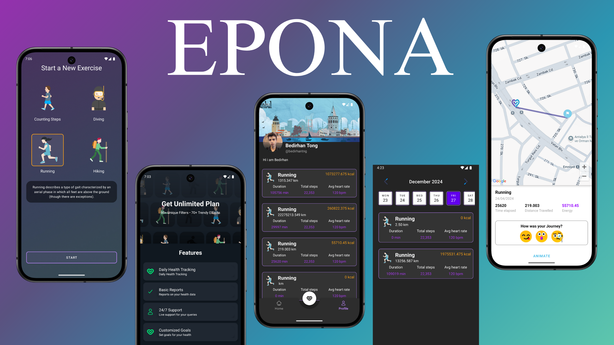

# Customized Personal Health Tracker

## Table of Contents

* [About](#about)
* [Features](#features)
* [Screenshots](#screenshots)
* [Managing](#managing)
* [Technologies](#technologies)
* [Installing Epona](#setup)

## About
- EPONA is a personal health tracker Android application. The application allows the user to monitor the performance for various activities such as running, step counting, diving, breath taking.

- A personal health tracker app build with [Kotlin](https://kotlinlang.org/) and [Firebase](https://firebase.google.com/).

## Features

1. `Allows users to login and gain access to the application.`
    - If the user has forgotten his/her password, he/she can access his/her account by using only one of the following information: email, phone number or username.
2. `Activity tracking for running, hiking, cycling, and swimming.`
    - EPONA is a customised health tracker application for different activities. It gives freedom to the user by offering flexible preference options.
3. `Map tracking during activities.`
    - Running activity : EPONA will show the user which paths the user has followed on the map to the current location, how many steps the user has taken in total, average speed, total distance travelled (km), energy consumption and time elapsed while the user is doing the activity.
4. `Log storage for past activities.`
    - Before you start any activity in EPONA, EPONA asks you whether you want to keep a record of the activity for history. You can access the statistical data of the activities you have saved days, weeks or even months later.
5. `Detailed user profile with activity statistics.`
    - The profile includes a table of the number of steps taken in the current day by hours and a brief summary of the different activities performed during the day.

## Screenshots
- You can follow [here](https://www.canva.com/design/DAFmfO0lvMI/yiyRrkEo4jl820y_KGG1yg/edit) to access presentation of project.

|                0000                    |   0001                   |       0010                   |
|:-----------------------------------------:|:------------------------------------------:|:------------------------------------------:|
|  |  |   |  

|                0000                    |   0001                   |       0010                   |
|:-----------------------------------------:|:------------------------------------------:|:------------------------------------------:|
|  |  |   |  

|                0000                    |   0001                   |       0010                   |
|:-----------------------------------------:|:------------------------------------------:|:------------------------------------------:|
|  |  |   |  

## 🛠️ Technologies

<b>📱 Frontend</b>

* **UI Framework**
  - Jetpack Compose
  - Material 3 Design
  - Custom Composables
  - Navigation Component

* **State Management**
  - ViewModel
  - Kotlin Flow
  - StateFlow

<b>🔧 Backend & Data</b>

* **Firebase Services**
  - Authentication
  - Firestore
  - Storage
  - Analytics

* **Local Storage**
  - SharedPreferences
  - Room Database (planned)

<b>📚 Libraries</b>

* **Dependency Injection**
  - Dagger Hilt

* **Image Loading**
  - Coil

* **Maps**
  - Google Maps SDK
  - Maps Compose

* **Other**
  - Kotlin Coroutines
  - Android KTX

## Setup
- The first thing you need to do is open the project in Android Studio on your own computer using the project's Github link.
- Then you need an unique Google Maps API key. You can get it from [this](https://developers.google.com/maps/documentation/javascript/get-api-key?hl=tr) website.
- If you don't know how to get **Google Maps API key** for this project then you can also use the same link.
    - If you get your unique Google Maps API key then you should change the value of **google_maps_key** on ___values.xml___ and ___AndroidManifest.xml___ file.
- If you are all set then you can run the EPONA on your device.
- But you have to restrict your **Google Maps API key** from Google Cloud Platform. [Here](https://developers.google.com/maps/api-security-best-practices?hl=tr) you can learn how to restrict your Map API key for android applications.
